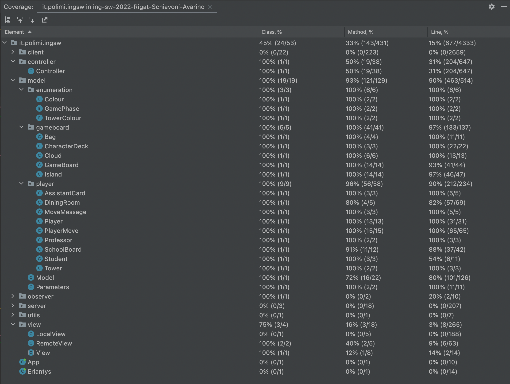

# Software Engineering final project

**Eriantys** is the final project of **Software Engineering** course held
at Politecnico di Milano (2021/2022).

Final vote: 30/30


## Implemented Functionalities
| Functionality | Status |
|:-----------------------|:------------------------------------:|
| Basic rules | ✅ |
| Complete rules | ✅ |
| Socket | ✅ |
| CLI | ✅ |
| GUI | ✅ |
| Multiple games | ✅ |
| 12 character cards | ✅ |

#### Legend
⛔ Not Implemented &nbsp;&nbsp;&nbsp;&nbsp; ⚠️ Implementing&nbsp;&nbsp;&nbsp;&nbsp; ✅ Implemented

## Running

First of all [install Java SE 17](https://www.oracle.com/java/technologies/javase/jdk17-archive-downloads.html) on your computer.

Then download the jar [here](Deliverables/Jar/), and move it to the desktop.

Open the directory of the jar using:

```
cd Desktop
```

To launch the game use one of the following commands:

```
java -jar mac_arm.jar
```

```
java -jar mac_intel.jar
```

```
java -jar win.jar
```

If you don't have one of the above operating system, [download JavaFX 18.0.1 SDK](https://gluonhq.com/products/javafx/) and use the following command in the directory of the jar (one of the three, is the same) and the directory you already downloaded.

```
java --module-path \Users\.."complete here"..\javafx-sdk-18.0.1\lib --add-modules=javafx.controls,javafx.fxml,javafx.media -jar \Users\.."complete here"..\win.jar
```

##

You'll have to choose if you want to run the server, CLI client or GUI client.

You can read the CLI and GUI instructions [here](Deliverables/instructions_CLI_GUI.pdf) (only in Italian)

Game rules [here](Deliverables/Gamerules/)

If you use the default configuration on the server, the port is 50000.

If you use the default configuration on the client, the ip is 127.0.0.1 and the port is 50000.

The recommended computer settings for the GUI are: 
* Resolution 1440x900  (13inches at least)

## Coverage
The model has a test coverage of:
* Classes: (19/19) 100%
* Methods: (121/129) 93%
* Lines: (463/514) 90%




## Authors
* [Matteo Rigat](https://github.com/MatteoRigat)
* [Nicolò Avarino](https://github.com/nicoloavarino)
* [Giuseppe Schiavoni](https://github.com/Giuseppe-Schiavoni)

**Teacher** Gianpaolo Cugola

# Tools
* Maven - Dependency Management
* Intellij - IDE
* JavaFX - GUI

## License
This project is developed in collaboration with [Politecnico di Milano](https://www.polimi.it/) and [Cranio Creations](https://www.craniocreations.it/).

